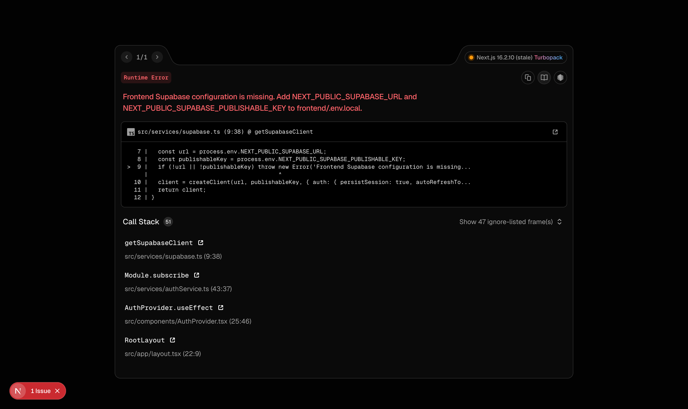
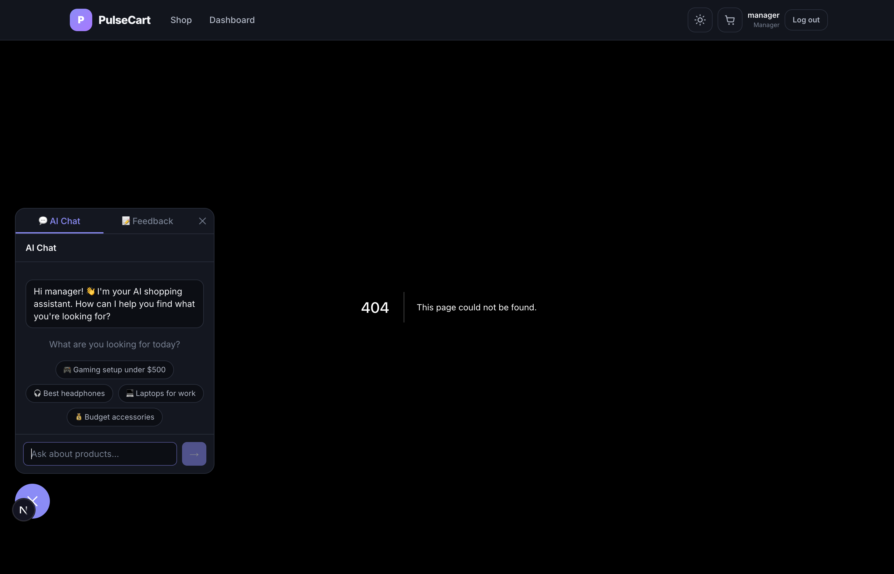
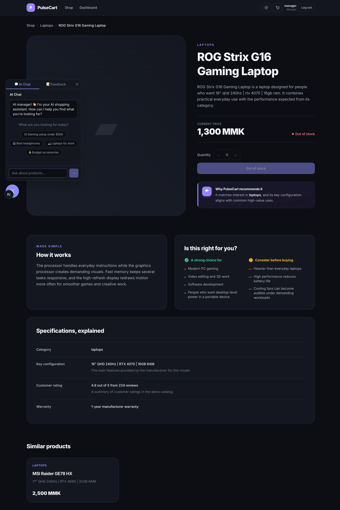
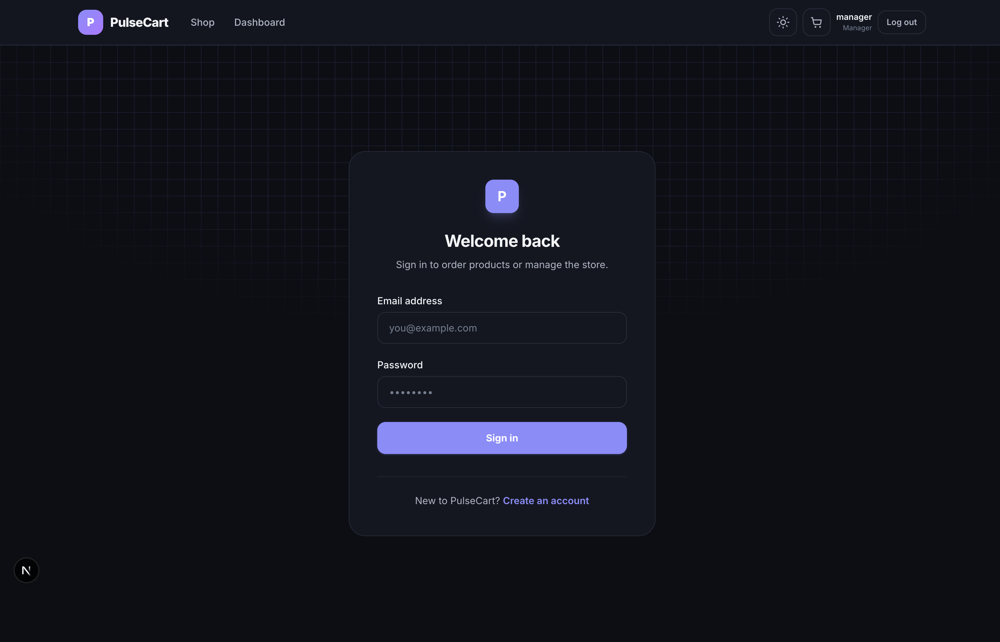
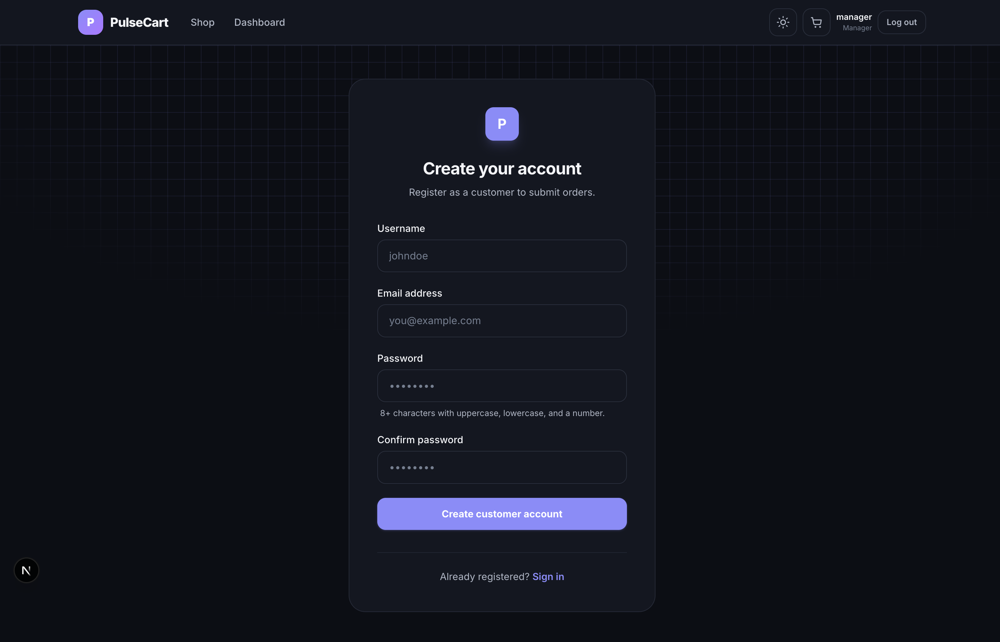
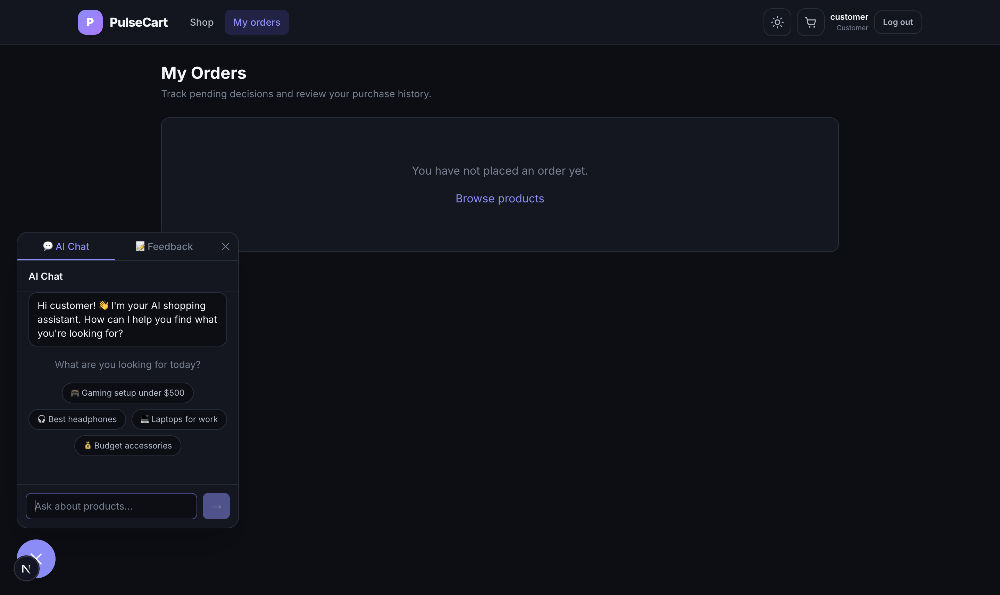
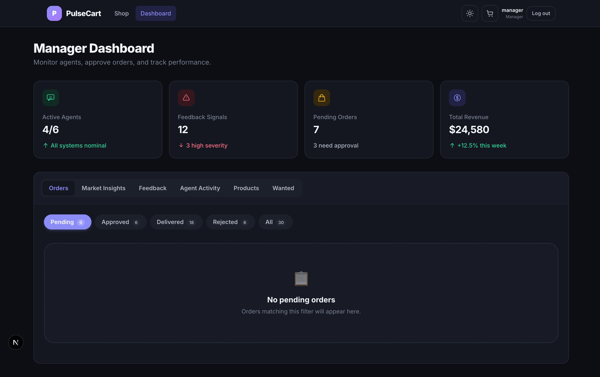

# PulseCart — Agentic Commerce Operations Copilot

> Multi-agent shopping platform where 5 AI agents collaborate in real-time — recommending products, analyzing competitors, coordinating orders, aggregating feedback, and powering conversational commerce.


## Screenshots

| Page | Preview |
|------|---------|
| **Shop Homepage** — AI-powered product storefront with search, category filtering, and intelligent ranking |  |
| **Product Catalog** — 40+ products with transparent, explainable recommendations |  |
| **Product Detail** — AI-powered explanations, specifications, and similar product suggestions |  |
| **Login** — Role-based access (customer / manager) |  |
| **Register** — Account creation |  |
| **Customer Orders** — Purchase history and order tracking |  |
| **Manager Dashboard** — Order management, market analysis, feedback insights, and agent activity traces |  |

## Status

| Phase | Status | Description |
|-------|--------|-------------|
| Phase 1 | ✅ Complete | Frontend with mock data |
| Phase 2 | ✅ Complete | FastAPI backend + 5 AI agents + Supabase |
| Orders | ✅ Complete | Full order lifecycle (create → approve/reject → deliver → email) |
| AI Agents | ✅ Complete | Chat, Feedback, Recommender, Market Analyst, Order Coordinator |

## Quick Start

### Frontend

```bash
cd frontend
npm install
npm run dev
```

Open [http://localhost:3000](http://localhost:3000)

### Backend (Mock Mode — default)

```bash
cd backend
python -m venv .venv
source .venv/bin/activate
pip install -r requirements.txt
uvicorn app.main:app --reload --port 8000
```

API docs: [http://localhost:8000/docs](http://localhost:8000/docs)

**Demo accounts (mock auth):**
- Manager: `manager@pulsecart.demo` / `Manager123!`
- Customer: `customer@pulsecart.demo` / `Customer123!`

Demo bearer tokens:
- Customer: `Bearer demo-customer-token`
- Manager: `Bearer demo-manager-token`

### Backend (Supabase Mode)

1. Create a Supabase project
2. Run SQL migrations in order: `sql/001_day1_schema.sql` → `002_auth_profile_trigger.sql` → `003_product_catalog_and_storage.sql` → `004_order_delivery.sql` → `005_chat_and_wanted_products.sql`
3. Set `USE_MOCK_DATA=false` in `backend/.env`
4. Seed products: `python scripts/seed.py`
5. Promote manager: `python scripts/set_user_role.py manager@example.com manager`

## What's Built

### Frontend ✅
- **Next.js 16 + Tailwind CSS 4** — App Router with `src/` directory
- **18 components** — 12 top-level + 6 dashboard panels
- **6 routes** — Home (shop), Login, Register, Product Detail, Orders, Manager Dashboard
- **10 services** — API, Auth, Chat, Feedback, Manager Product, Order, Product, Search, Storage, Supabase
- **Dark/light theme** — 17 CSS custom properties with `data-theme` attribute
- **Responsive design** — Mobile-first layout
- **Floating AI chat widget** — Conversational product discovery
- **Role-based UI** — Customer vs manager views

### Backend ✅
- **FastAPI** — 16 API endpoints across 7 route files
- **Dual repository pattern** — `MemoryRepository` (mock) or `SupabaseRepository` (production)
- **5 AI agents:**
  - **Recommender Agent** — Keyword-based product ranking (name 5pts, category 3pts, description 2pts)
  - **Market Analyst Agent** — Competitor price comparison analysis
  - **Order Coordinator Agent** — Order lifecycle (create → approve/reject → deliver) + Burmese email notifications
  - **Feedback Agent** — Anthropic API sentiment analysis with keyword fallback
  - **Chat Agent** — Conversational AI with tool-use (product lookup, order status, search)
- **Supabase integration** — PostgreSQL, auth, storage, RLS policies, pgvector-ready

### Agent System

Five AI agents collaborate in real-time:

| Agent | Function | Technology |
|-------|----------|------------|
| 🤖 **Recommender** | Keyword-scored product ranking | Python scoring engine |
| 📊 **Market Analyst** | Competitor price comparison | Data analysis |
| 📦 **Order Coordinator** | Order processing + email delivery | SMTP (Burmese language) |
| 💬 **Feedback Agent** | Sentiment analysis & insights | Anthropic API + keyword fallback |
| 🗣️ **Chat Agent** | Conversational product discovery | Anthropic API + tool-use |

Every agent action logs to `audit_log` with agent name, action, input, output, and timestamp — viewable in the Manager Dashboard's Agent Activity panel.

## Project Structure

```
PulseCart/
├── frontend/              # Next.js 16 app
│   ├── src/
│   │   ├── app/           # 6 routes (App Router)
│   │   ├── components/    # 18 components
│   │   ├── data/          # 5 fixture files
│   │   ├── services/      # 10 services
│   │   └── types/         # 20 TypeScript interfaces
│   └── package.json
├── backend/               # FastAPI Python app
│   ├── app/
│   │   ├── agents/        # 5 AI agents
│   │   ├── routes/        # 7 route files
│   │   ├── models/        # 23 Pydantic schemas
│   │   ├── services/      # Email, repository, auth
│   │   └── config.py      # pydantic-settings
│   ├── sql/               # 5 migration files
│   ├── scripts/           # seed.py, set_user_role.py
│   └── tests/
├── screenshots/           # App previews
├── .planning/             # Design docs & roadmap
├── PROJECT.md             # Full project plan
└── CLAUDE.md              # Dev instructions
```

## Tech Stack

| Layer | Technology | Status |
|-------|-----------|--------|
| Frontend | Next.js 16 + Tailwind CSS 4 | ✅ Complete |
| Backend | FastAPI (Python) | ✅ Complete |
| Agents | Python (keyword + Anthropic API) | ✅ Complete |
| Database | Supabase (PostgreSQL + pgvector) | ✅ Complete |
| Auth | Supabase Auth + demo token fallback | ✅ Complete |

## API Endpoints (16 total)

**Public:**
- `GET /health` — Health check
- `GET /products` — Product catalog
- `GET /products/{id}` — Product details
- `POST /search` — Search with agent re-ranking

**Authenticated (Customer):**
- `POST /orders` — Create order
- `GET /orders/me` — Order history
- `POST /feedback` — Submit feedback
- `POST /chat` — Chat with AI agent (streaming)

**Manager Only:**
- `GET /manager/orders` — Pending orders
- `PATCH /manager/orders/{id}` — Approve/reject order
- `POST /manager/orders/{id}/deliver` — Mark delivered (triggers Burmese email)
- `POST /manager/products` — Create product (FormData)
- `PUT /manager/products/{id}` — Update product
- `DELETE /manager/products/{id}` — Delete product
- `GET /agents/traces` — Agent activity logs
- `GET /feedback` — All feedback messages
- `GET /feedback/insights` — Cached feedback insights
- `POST /feedback/analyze` — Trigger feedback analysis

## Order Lifecycle

```
Customer creates → pending → Manager approves/rejects
                                │
                           If approved → Manager delivers → Burmese email sent
                           If rejected → Rejection email sent
```

## Environment Setup

Copy the example files:
```bash
cp backend/.env.example backend/.env
cp frontend/.env.local.example frontend/.env.local
```

### Frontend (`frontend/.env.local`)
- `NEXT_PUBLIC_SUPABASE_URL` — Supabase project URL
- `NEXT_PUBLIC_SUPABASE_PUBLISHABLE_KEY` — Supabase publishable key
- `NEXT_PUBLIC_API_URL` — Backend URL (default `http://localhost:8000`)

### Backend (`backend/.env`)
- `USE_MOCK_DATA` — Enable/disable mock mode (default `true`)
- `SUPABASE_URL`, `SUPABASE_PUBLISHABLE_KEY`, `SUPABASE_SECRET_KEY` — Supabase credentials
- `ANTHROPIC_API_KEY` — For feedback agent and chat agent LLM analysis
- `ANTHROPIC_BASE_URL` — Custom Anthropic API base URL (optional)
- `CHAT_MODEL` — Model for chat agent (default `mimo-v2.5-pro`)
- `EMAIL_ENABLED`, `SMTP_*` — Email delivery settings (default disabled)

## Documentation

- [Project Plan](PROJECT.md) — Full sprint plan, architecture, and setup guide
- [Dev Instructions](CLAUDE.md) — Development commands and conventions
- [Planning Docs](.planning/) — Design sketches, roadmap, requirements

## License

Hackathon project — not for production use.
